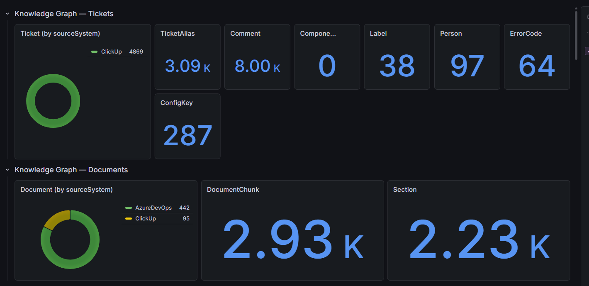
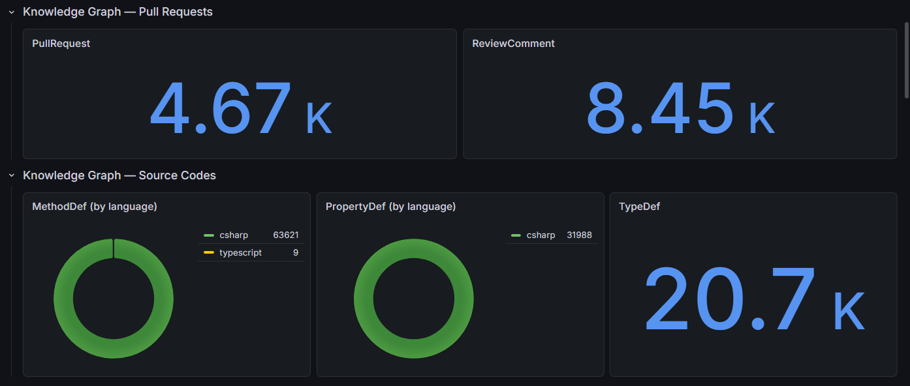

<p align="center">
  
  
  
  
  
  
  
</p>

<h1 align="center">Adam AI — Ticket Intelligence Platform</h1>

<p align="center">
  <b>Connect your tools. Build a knowledge graph. Let AI find the answers.</b>
</p>

<p align="center">
  <i>Adam connects your ticketing systems, documentation wikis, code repositories, and pull requests into a unified knowledge graph — then exposes it to AI agents via the <a href="https://modelcontextprotocol.io/">Model Context Protocol (MCP)</a>.</i>
</p>

---

<p align="center">
  <a href="#-getting-started">Getting Started</a> •
  <a href="#-mcp-tools-reference">MCP Tools</a> •
  <a href="#-monitoring-dashboard">Monitoring</a> •
  <a href="#-real-world-examples">Examples</a> •
  <a href="#-supported-integrations">Integrations</a> •
  <a href="#-license--trial">License</a>
</p>

---

## What is Adam?

Adam is a **ticket intelligence platform** that reads from your existing tools, indexes everything into a **knowledge graph** (Neo4j + Qdrant), and makes it searchable through any MCP-compatible AI assistant — GitHub Copilot, Claude, Cursor, OpenCode CLI, or your own agent.

Work that typically takes a developer **30–60 minutes** of manual cross-referencing across Jira, Confluence, GitHub, and code — Adam surfaces in **seconds**.

**Adam does NOT replace your tools.** It reads from them (read-only), indexes the data, and makes the knowledge accessible through AI.

### Key Highlights

- **Zero LLM cost** — Adam's core uses local embeddings (Ollama). The only AI cost is your team's existing Copilot/Claude subscription
- **Privacy-first** — Runs entirely on your infrastructure. Your data never leaves your environment
- **No vendor lock-in** — Switch ticketing systems without losing history
- **Works with any MCP-compatible AI** — GitHub Copilot, Claude Desktop, Cursor, Windsurf, OpenCode CLI etc
- **Finds what search can't** — Relationships between tickets, code, docs, and people that no single tool can surface alone

---

## 🚀 Getting Started

### Prerequisites

- [Docker Desktop](https://www.docker.com/products/docker-desktop) (latest version)
- A valid license key ([get a free trial](#-license--trial))

### 1. Clone this repository

```bash
git clone https://github.com/prosharp-adam/adam-ai.git
cd adam-ai
```

### 2. Configure your environment

Copy the example environment file and fill in your settings:

```bash
cp .env.example .env
```

Open `.env` in your editor. You only need to configure the services you want to enable — everything else can stay commented out or at defaults.

| Section       | Required?             | Description                                    |
| ------------- | --------------------- | ---------------------------------------------- |
| `LICENSE_KEY` | **Yes**               | Your Adam license key                          |
| `Jira`        | If using Jira         | Jira Cloud URL, email, API token, project keys |
| `ClickUp`     | If using ClickUp      | API token, workspace & space IDs               |
| `AzureDevOps` | If using Azure DevOps | Organization URL, PAT, project names           |
| `Confluence`  | If using Confluence   | Confluence URL, credentials, space keys        |
| `GitHub`      | If using GitHub       | Personal access token, org/repos               |
| `GoogleDrive` | If using Google Drive | Service account or OAuth credentials           |
| `CodeIndex`   | If indexing code      | Git repository URLs, languages to index        |

> **Tip:** Start with just one connector (e.g., Jira) to see results quickly. You can add more later.

### 3. Start Adam

```bash
docker compose up -d
```

This launches all components:

- **Neo4j** (knowledge graph database)
- **Qdrant** (vector database for semantic search)
- **Ollama** (local embedding model)
- **Adam API** (REST API & sync engine)
- **Adam Worker** (background sync jobs)
- **Adam MCP Server** (AI agent interface)
- **Grafana + Prometheus** (monitoring stack)

### 4. Connect your AI tool

Add the following MCP server configuration to your AI assistant:

<details>
<summary><b>VS Code / GitHub Copilot</b> — <code>.vscode/mcp.json</code></summary>

```json
{
  "servers": {
    "adam-docker": {
      "url": "http://127.0.0.1:8090",
      "type": "http",
      "headers": {
        "X-Adam-Client-Secret": "YOUR_CLIENT_SECRET"
      }
    }
  }
}
```

</details>

<details>
<summary><b>Claude Desktop</b> — <code>claude_desktop_config.json</code></summary>

```json
{
  "mcpServers": {
    "adam-docker": {
      "url": "http://127.0.0.1:8090",
      "type": "http",
      "headers": {
        "X-Adam-Client-Secret": "YOUR_CLIENT_SECRET"
      }
    }
  }
}
```

</details>

<details>
<summary><b>Cursor / Windsurf / Other MCP clients</b></summary>

```json
{
  "adam-docker": {
    "url": "http://127.0.0.1:8090",
    "type": "http",
    "headers": {
      "X-Adam-Client-Secret": "YOUR_CLIENT_SECRET"
    }
  }
}
```

</details>

> Replace `YOUR_CLIENT_SECRET` with the client secret from your `.env` file.

### 5. Start asking questions

Once syncing completes, ask your AI assistant things like:

- *"What feature introduced the republishing needed data quality status?"*
- *"Which tickets mention the batch export timeout when filtering by access control?"*
- *"When was the item locking mechanism changed from pessimistic to optimistic, and which PR implemented it?"*
- *"Find the ticket about the calendar widget breaking when switching between monthly and weekly views"*
- *"What code handles the data recipient group maintenance lock, and why does it never get released?"*

---

## 📊 Monitoring Dashboard

Adam ships with a pre-configured **Grafana** dashboard that shows real-time sync progress and knowledge graph statistics.

**Open the dashboard:** [http://localhost:3005/d/adam-overview/adam-e28094-sync-overview](http://localhost:3005/d/adam-overview/adam-e28094-sync-overview)

> Default credentials: `admin` / `admin`

### Knowledge Graph — Tickets & Documents

Track how many tickets, comments, documents, labels, people, and error codes have been ingested, broken down by source system.



### Knowledge Graph — Pull Requests & Source Code

Monitor pull request ingestion and code indexing progress — methods, properties, and type definitions across languages.



The dashboard provides:

- **Node counts** by type (Ticket, Comment, Document, PullRequest, MethodDef, TypeDef, etc.)
- **Source system breakdown** (Jira, ClickUp, AzureDevOps, Confluence, GitHub, etc.)
- **Language distribution** for indexed code (C#, TypeScript, Java, etc.)
- **Sync rate metrics** — how fast data is being processed

---

## 🛠 MCP Tools Reference

Once connected, your AI agent has access to **12 specialized tools** for querying the knowledge graph:

### Ticket Intelligence

| Tool                   | Description                                                                                                                                                                                                                                                                                    |
| ---------------------- | ---------------------------------------------------------------------------------------------------------------------------------------------------------------------------------------------------------------------------------------------------------------------------------------------- |
| `getTicketContext`     | **Start here.** Get the full context of a ticket in a single call — fields, comments, linked tickets, similar tickets (5), text search hits (10), related docs (3), reporter stats, component trends, error codes, config keys, PRs, recurring issue detection, and stale reference detection. |
| `getTicketTimeline`    | Get the full lifecycle of a ticket — status changes, comments, PRs, and links in chronological order.                                                                                                                                                                                          |
| `findSimilarTickets`   | Find semantically similar tickets using vector search. Supports status and component filters.                                                                                                                                                                                                  |
| `getRecentResolutions` | Get the last N resolved tickets for a component with resolution details and comments.                                                                                                                                                                                                          |

### Search & Discovery

| Tool              | Description                                                                                                        |
| ----------------- | ------------------------------------------------------------------------------------------------------------------ |
| `runTextSearch`   | Lucene full-text search across all knowledge graph nodes — tickets, comments, documents, code.                     |
| `searchDocuments` | Semantic search over documentation. Returns document chunks with section breadcrumb paths.                         |
| `searchCode`      | Search the codebase using graph traversal + semantic search. Finds classes, methods, callers, and callees.         |
| `getCodeContext`  | Get the full context of a type or method — dependencies, callers, callees, inheritance chain, and related tickets. |

### Graph & Schema

| Tool                  | Description                                                                                                                 |
| --------------------- | --------------------------------------------------------------------------------------------------------------------------- |
| `describeGraphSchema` | Get the graph schema — node types, edge types, indexes, and sample Cypher queries. Call this before writing custom queries. |
| `runCypherQuery`      | Execute a read-only Cypher query directly on the knowledge graph. Max 100 rows, 10s timeout.                                |

### Data Sync

| Tool         | Description                                                                                        |
| ------------ | -------------------------------------------------------------------------------------------------- |
| `syncTicket` | Sync a single ticket on-demand. Use when `getTicketContext` returns `TICKET_NOT_FOUND`.            |
| `syncAll`    | Start a full synchronization of all configured data sources with real-time progress notifications. |

---

## 🌍 Real-World Examples

All examples below are **real investigations produced with Adam**, each taking under 10 minutes — compared to hours of manual cross-referencing.

### Discovering a Recurring Bug Pattern (30+ tickets over 4 years)

> **Scenario:** A support ticket reported that users can't edit data recipient groups — the UI shows "Maintenance is in progress."

Adam instantly discovered this wasn't a one-off issue — it was a **systemic problem spanning 30+ tickets over 4 years**, across three separate deployments. Adam surfaced the full timeline, identified the root cause in code (a database lock that's never cleaned up when a background workflow fails), and showed that every previous occurrence was resolved with the same manual SQL workaround.

**Without Adam:** A developer would see one ticket, apply the SQL fix, and move on — never realizing the pattern.
**With Adam:** The full 4-year history and root cause are visible in one query, making the case for a permanent fix undeniable.

### Understanding Complex Domain Attributes

> **Scenario:** "What are the differences between Last Change Date Time, Last Updated Date Time, and Publication Date Time?"

Adam searched across **14 related tickets spanning 2016–2026**, pulled relevant code references and documentation, and compiled a complete specification — including known edge cases where background workflows unexpectedly update dates.

**Result:** A comprehensive answer that would have required reading through years of ticket history, code, and tribal knowledge.

### Tracing a Bug and Closing Two Tickets at Once

> **Scenario:** Exporting items to Excel with "Access Control only" selected causes a browser error.

Adam found **two separate tickets** filed 6 months apart by different people, with different priorities. A developer working on either ticket alone would likely fix it and never discover the duplicate. Adam connected them instantly, traced the exact code path, identified that a method returns `null` when no data exists (causing the browser to show raw XML), and proposed a one-line fix — **closing both tickets with a single change.**

### Finding a Needle in 10,000+ Tickets

> **Scenario:** "Find the ticket about item editor frontend performance investigation with caching and preloading results."

Adam performed a **multi-step search** — starting with semantic similarity, then narrowing with text search and graph queries — to locate the ticket among thousands. The ticket had a vague title ("Investigate possible frontend optimizations") but Adam matched it through its description content. Jira's built-in AI tool **couldn't locate the ticket** even with multiple search attempts.

---

## 🔌 Supported Integrations

| Category             | Supported Systems                                                     |
| -------------------- | --------------------------------------------------------------------- |
| **Ticketing**        | Jira, ClickUp, Azure DevOps Work Items                                |
| **Documentation**    | Confluence, ClickUp Docs, Azure DevOps Wiki, Google Drive             |
| **Code & PRs**       | GitHub, Azure DevOps Pull Requests                                    |
| **Code Indexing**    | Any Git repository (C#, TypeScript, JavaScript, Java via tree-sitter) |
| **Document Parsing** | Docling (PDF, Word, HTML → structured sections)                       |

> **More integrations coming soon:** Slack, Microsoft Teams, ServiceNow, Notion, Linear, Datadog, and custom REST connectors. [Let us know](mailto:adam.kovacs@pro-sharp.hu) what your team needs.

---

## 📄 License & Trial

Adam is a commercial product with a **free trial** available.

### Get a Free Trial License

**Email:** [adam.kovacs@pro-sharp.hu](mailto:adam.kovacs@pro-sharp.hu)

Include:

- Your name and organization
- Which integrations you plan to use
- Approximate team size

You'll receive a trial license key to get started immediately.

### Subscription Plans

🌐 **Self-service subscription website coming soon** — you'll be able to sign up, manage your license, and upgrade plans directly online.

---

## 💬 Support & Contact

- **Email:** [adam.kovacs@pro-sharp.hu](mailto:adam.kovacs@pro-sharp.hu)
- **Issues:** Use the [GitHub Issues](../../issues) tab for bug reports and feature requests

---

<p align="center">
  <sub>Built with .NET 10 • Neo4j • Qdrant • Ollama • Grafana • MCP</sub>
</p>
